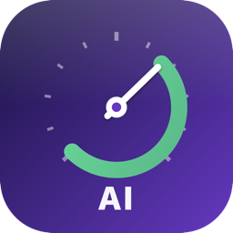

# AI Taskbar

<p align="center">
  
</p>

<p align="center">
  <b>Native macOS menu-bar tracker for LLM usage across 8 providers.</b><br/>
  Anthropic Claude · OpenAI Codex/ChatGPT · OpenRouter · Z.AI (GLM) · Kimi (Moonshot) · Gemini · DeepSeek · xAI (Grok)
</p>

<p align="center">
  <a href="https://github.com/justoeu/ai-taskbar/releases"></a>
  <a href="LICENSE"></a>
  
  
  
</p>

---

## What you get

A gauge icon in your menu bar showing the **highest utilization** across your LLM providers. It reflects only the **expanded (open) cards** in the popover — collapse a provider's card to drop it out of the gauge, so you can focus the number on the subscriptions you actually care about. Click it for a per-provider breakdown:

- **Plan label** ("Claude Max 20x", "ChatGPT Plus", "GLM Lite")
- **Per-window utilization** with color thresholds (green → yellow → red) — for Claude this includes the 5-hour session, 7-day weekly, any **per-model weekly windows** (e.g. Fable), and a **usage-credits** meter (shown with the money spent/limit, e.g. `R$556.68 / R$600.00`). Model windows are parsed generically from the API's `limits[]`, so a newly-launched model appears without an app update.
- **Reset countdown** ("resets 4 hrs, 12 min"; once the reset passes it shows "reset due — awaiting auto-refresh…" instead of counting back up)
- **24-hour sparkline** with dashed threshold lines, current value, and peak marker
- **Daily + 7-day cost estimates** computed locally from your CLI logs
- **Per-model breakdown** ("opus-4-7 $1850 / haiku-4-5 $245")
- **Click the card header** (chevron + name + empty space) to expand/collapse; dashboard / reorder / refresh stay on the trailing buttons
- **Reorder cards** with ↑ / ↓ on each header (order saved on this Mac)
- **Locked card with explanation** when a provider has no credentials

The app runs entirely on-device — **no telemetry, no remote logging, no auto-update without your click**.

## Table of contents

- [Install](#install)
- [Setup per provider](#setup-per-provider)
- [What's in this version](#whats-in-this-version)
- [How it works](#how-it-works)
- [Configuration](#configuration)
- [Where data lives](#where-data-lives)
- [Privacy & security](#privacy--security)
- [Build from source](#build-from-source)
- [Releasing a new version](#releasing-a-new-version)
- [Architecture](#architecture)
- [Contributing](#contributing)
- [License](#license)

## Install

### Option 1 — Download the DMG (recommended)

1. Download the DMG matching your Mac from [Releases](https://github.com/justoeu/ai-taskbar/releases):
   `ai-taskbar-X.Y.Z-arm64.dmg` (Apple Silicon, smaller) or the universal
   `ai-taskbar-X.Y.Z.dmg` (Intel + Apple Silicon).
2. Open the DMG and drag **AI Taskbar.app** to **/Applications**.
3. **First launch** — release DMGs are Developer ID-signed and notarized by
   Apple, so they open with no Gatekeeper warning. (Only ad-hoc DMGs from
   old releases or local `make dmg` builds warn; bypass with right-click →
   Open, or `xattr -dr com.apple.quarantine /Applications/AiTaskbar.app`.)

### Option 2 — Build from source

```bash
git clone https://github.com/justoeu/ai-taskbar.git
cd ai-taskbar
make app              # host arch only — fast for dev
make app-universal    # arm64 + x86_64 fat binary
open build/AiTaskbar.app
```

Requirements: macOS 13+ (Ventura), Swift 5.10+ (Xcode Command Line Tools is enough — `xcode-select --install`).

### Option 3 — Check for updates from inside the app

Click the gauge icon → ⓘ About → **Procurar atualizações** / **Check for updates**. The button hits `github.com/justoeu/ai-taskbar/releases/latest` directly, compares semver against your installed version, and offers a one-click DMG download that opens in Finder for you to drag to /Applications.

## Setup per provider

The app **reads existing credentials** — you don't need to paste API keys for the OAuth-based ones.

| Provider | Source | Setup |
|---|---|---|
| **Claude** | macOS Keychain entry `Claude Code-credentials` | Run `claude` once; use the in-app interactive authorization when requested |
| **Codex / ChatGPT** | `~/.codex/auth.json` | Run `codex` CLI once. Zero setup. |
| **OpenRouter** | API key | Add `api_key = "sk-or-v1-..."` to `[openrouter]` in config |
| **Z.AI (GLM)** | API key | Add `api_key = "..."` to `[zai]` in config |
| **Kimi (Moonshot)** | API key | Add `api_key = "sk-..."` to `[kimi]` in config |
| **DeepSeek** | API key | Add `api_key = "sk-..."` to `[deepseek]` in config |
| **Gemini** | API key | Add `api_key = "AIza..."` to `[gemini]` — **heartbeat only** (see below) |
| **xAI (Grok)** | Management key + team ID | Create a **management** key at [console.x.ai](https://console.x.ai) → Settings → Management Keys (not the inference API key); copy the team UUID from Team settings; set `api_key` + `team_id` under `[xai]` |

> ⚠️ **macOS env vars footgun:** GUI apps launched from Finder do **not** inherit your shell environment. If you set `OPENROUTER_API_KEY=...` in `~/.zshrc`, the menu bar app **won't see it**. Three workarounds:
> 1. **Put the key directly in `config.toml`** (file is `chmod 600`).
> 2. Launch from a terminal: `OPENROUTER_API_KEY=sk-... open /Applications/AiTaskbar.app`.
> 3. Set it globally: `launchctl setenv OPENROUTER_API_KEY "sk-..."` (until reboot).

### Claude Code on macOS — Keychain access

Claude Code stores its OAuth token in the macOS Keychain, not in a user-readable
file like Codex's `~/.codex/auth.json`. The item is created for Claude Code's
own signing identity. Scheduled refreshes never display a surprise password
dialog: when macOS blocks a silent read, click **Authorize** in the Claude card.
That user-initiated action permits the native Keychain dialog and keeps the
credential only in process memory; it does not rewrite Claude Code's ACL or
copy the token to disk. Permission can be requested again after the app or
Claude Code restarts/re-authenticates.

For users who explicitly prefer a durable ACL grant, the following advanced
command adds the official signed AI Taskbar build (`teamid:5HHL78743R`) to the
current macOS user's live Claude credential:

```bash
security set-generic-password-partition-list \
  -a "$USER" \
  -s "Claude Code-credentials" \
  -S "apple-tool:,apple:,teamid:5HHL78743R" \
  "$HOME/Library/Keychains/login.keychain-db"
```

The command prompts for the **login Keychain password** (normally the password
used to log in to the Mac). Do not add `-k`; that would expose the password in
the process arguments/shell history. The command changes only the ACL and does
not print or copy the OAuth token.

If it reports that the item was not found, open **Keychain Access**, search for
`Claude Code-credentials`, select the most recently modified account-bearing
entry, and replace `$USER` with its **Account** value. Old Claude Code versions
can leave an account-less legacy entry beside the live one. A fork signed by a
different Apple Developer Team must likewise replace `5HHL78743R` with the
`TeamIdentifier` reported by `codesign -dvv /path/to/AiTaskbar.app`.

Claude Code owns this Keychain item. A later `/login`, token migration, or CLI
update may recreate it and restore Claude Code's original ACL; if the Keychain
warning returns, use the in-app interactive read again (or repeat the advanced
command for the new live entry). This integration is therefore best-effort
until Anthropic provides a public third-party OAuth/quota API.

### Claude `429 rate_limit_error`

When the warning tooltip contains Anthropic's JSON with
`"type": "rate_limit_error"`, the server really returned HTTP 429; it is not a
snapshot-decoding error. AI Taskbar keeps showing the last cached snapshot and
applies a per-provider exponential cooldown of 5, 10, 20, 40, then 60 minutes.
Other providers keep their normal schedule, and manual refresh cannot bypass
the affected provider's active cooldown. The existing scheduler also adds its
short 60-second global settling delay after a 429 cycle. If 429s persist, you
can still increase `[ui] refresh_interval_seconds` from `300` to `900` or
`1800`. The subscription usage endpoint is undocumented and Anthropic publishes
no polling quota for it, so the app cannot calculate an exact retry time unless
the response supplies one.

### xAI (Grok) — API team billing, not SuperGrok consumer usage

The xAI card reads the **Management API** (`management-api.x.ai`): prepaid credit balance and current-cycle postpaid spend vs soft spending limit. That is **developer/team API billing**, not the weekly SuperGrok / grok.com consumer quota UI. Inference keys on `api.x.ai` cannot read billing; a separate management key + `team_id` are required. SuperGrok subscription limits have no public usage API today.

### Google Gemini — limited; no usable usage/quota API

Gemini ships as a provider but it can only do an **API-key heartbeat**: with a Google AI Studio key it validates the key and reports the model count (`GET /v1beta/models`). **It cannot show usage or cost**, because none of Google's surfaces expose a readable consumption API for the products people actually have:

| Surface | Usage API? |
|---|---|
| **Gemini app subscription** (Plus / AI Pro / Ultra, `gemini.google.com/usage`) | ❌ No public API — the 5-hour/weekly limits live only in the app UI. |
| **Developer API** (AI Studio key / Vertex via a GCP project) | ✅ Cloud Monitoring (`serviceruntime.googleapis.com/quota/...`) — but it measures *GCP-project API requests*, needs a Cloud project + monitoring scope, and is **not** your consumer subscription. |
| **Gemini Code Assist** (the `gemini-cli`, `~/.gemini/oauth_creds.json`) | ⚠️ Undocumented `cloudcode-pa.googleapis.com/v1internal:retrieveUserQuota` — per-model `remainingFraction`. **Being retired for individuals on 2026-06-18** in favor of Antigravity, and it's the free coding tier, *separate from* a paid Gemini app subscription. |
| **Antigravity CLI** (`agy`) | ❌ No `usage` subcommand; the app stores auth as encrypted Electron cookies + Keychain safeStorage — no readable token, no usage endpoint. |

**Bottom line:** there is no durable, official way to read your Gemini *subscription* usage today. If you don't have (or don't want) a Gemini API key, set `[gemini] enabled = false` in `config.toml` to hide the "no credentials" row. This will be revisited if Google ships a real consumer usage API (OAuth, not web cookies).

## What's in this version

### v0.12 — xAI billing, reorderable cards, full-header expand

- **Eighth provider — xAI (Grok) via Management API.** Prepaid balance + monthly spend vs soft limit from `management-api.x.ai` (management key + team ID). Inference host `api.x.ai` is rejected by the host allow-list. Settings UI labels the fields as management key / team ID with localized help. Dashboard link points at the console usage page.
- **Reorder vendor cards** with ↑ / ↓ on each card header. Order is stored in `UserDefaults` (`vendor_order`) on this Mac; rotating menu-bar mode follows the same order. (Drag-and-drop is unreliable inside `MenuBarExtra` windows on macOS, so buttons are the supported path.)
- **Click anywhere on the leading header** (chevron + name + plan + flexible space) to expand/collapse. Dashboard, reorder, and refresh remain separate trailing controls.

### v0.2 — Gemini, calmer cadence, honest countdown, no more Keychain prompts

- **Sixth provider — Google Gemini.** Uses `GET /v1beta/models` as an authenticated heartbeat (Generative Language API has no public quota REST endpoint). Auth via `x-goog-api-key` header, never `?key=` query string. Host allow-listed to `generativelanguage.googleapis.com`. `GeminiConfig.validate` is strict on the API-version segment — `base_url` must be exactly `/v1`, `/v1beta`, or `/v1alpha` (or a sub-path of one). A typo like `/v1xxx` is rejected at config-load with an NSLog warning, instead of producing a silent 404 at first fetch. A future Google rename (`models` → `availableModels`) lands as `AppError.schema` + red row, not as a silently green "no models visible".
- **Default refresh cadence raised from 150 s → 300 s (5 min).** A conservative starting point for undocumented usage endpoints; individual vendors can still impose longer or account-wide 429 windows. Floor is still 15 s; override via `[ui] refresh_interval_seconds = …`.
- **Forward countdown in the popover header.** "Próx. em 4:59" replaces the old "atualizado há …" — anchored on `UsageStore.lastScheduledTickAt`, which is stamped by `RefreshScheduler.markScheduledTick()` immediately before every cycle. When the scheduler is in the 60 s post-429 back-off the label switches to "Aguardando rate-limit…"; while a fetch is in flight it says "Atualizando…". Pre-computed `@Published` aggregates (`isAnyVendorLoading`, `hasRateLimitedVendor`) keep the per-second TimelineView reading flat properties instead of re-scanning the vendor array; localized strings are memoized at type init.
- **Rate-limit back-off.** When any vendor's most recent refresh ended in HTTP 429, `RefreshScheduler` adds `rateLimitBackoff` (60 s) to the next sleep. Stays applied while at least one vendor keeps 429-ing; clears automatically when responses go green. `UsageStore.hasRateLimitedVendor` detects both `.failed(429, _)` AND stale-`.ok` outcomes whose cached `lastError.status == 429` (CachedFetch hides single 429s as `.ok(stale)` whenever any payload is cached).
- **Per-provider exponential cooldown.** A vendor that keeps returning 429 is skipped for 5, 10, 20, 40, then at most 60 minutes. Manual refresh respects the same deadline, so repeated clicks cannot turn a temporary throttle into a longer one; providers that are not rate-limited continue refreshing.
- **Cache TTL automatically derived from the cadence** — `max(15, refresh_interval_seconds − 5)`. Popover opens between scheduled refreshes still serve from cache, but the scheduled tick at T=interval always finds an expired entry (`age ≈ interval > ttl`) and goes straight to the network without needing `forceRefresh: true`. The 5-second margin absorbs Task.sleep jitter.
- **Keychain write no longer triggers the macOS password prompt.** `KeychainCredentialReader.writeBack` passes `kSecUseAuthenticationUIFail` (the deprecated key — the modern `LAContext.interactionNotAllowed` doesn't work for plain generic-password items without a `SecAccessControl`) and treats `errSecInteractionNotAllowed` as best-effort: logs to Console.app with the exact `security set-generic-password-partition-list` fix and returns. The renewed credentials are mirrored to an in-memory `_pendingUpdate`; the next `read()` reconciles against the on-disk copy by `expiresAtMs` (so an external rotation via Claude Code CLI wins automatically when it lands). Menu-bar app (LSUIElement) no longer freezes behind an invisible SecurityAgent dialog after every `make app` rebuild.

### v0.1.0 — initial release

**Core**
- 5 LLM providers — Anthropic Claude, OpenAI Codex/ChatGPT, OpenRouter, Z.AI (GLM), Kimi (Moonshot)
- OAuth auto-refresh for Anthropic + OpenAI using their official `client_id`s
- Per-vendor caches with 150-second TTL (matched to the v0.1 default refresh interval) and 7-day stale fallback

**UI**
- SwiftUI `MenuBarExtra` with accordion popover (locked providers stay collapsed)
- 24-hour sparkline with dashed threshold lines (warning + critical), current-value annotation, and peak marker
- Color-coded gauge in the menu bar (rotating mode optional)
- Per-model cost breakdown (today / last 7 days side-by-side)
- About panel with version + GitHub Releases update checker; on Developer ID-signed builds it also credits the developer, read live from the binary's signing certificate (ad-hoc builds omit the line)

**i18n** — 3 languages out of the box (`en`, `pt-BR`, `es`) with `[ui] language = ...` config override

**Security**
- macOS Keychain reader with single-pass query (1 ACL prompt for single-account, 2 for multi-account); auto-discovers the live entry via freshest-token-wins, so a stale orphan left by an older Claude Code version never shadows the one the CLI keeps refreshed
- `~/.codex/auth.json` write-back with atomic `0o600` chmod **before** rename
- All cache/config files chmod `0o600`, support dir `0o700`
- OpenAI cache strips PII (`user_id`/`account_id`/`email`)
- `KimiConfig.base_url` host allow-listed (SSRF defense)
- TOCTOU symlink refusal on cache dirs
- Optional TLS pinning via TOFU SPKI hashes

**Cost tracking**
- Reads `~/.claude/projects/*/*.jsonl` (Claude Code sessions) — byte prefilter rejects ~73% of lines without JSON parse
- Reads `~/.codex/logs_2.sqlite` via libsqlite3 — regex-based `model=`/`total_usage_tokens=` extraction
- Pricing table for Anthropic + OpenAI models, used by the local Claude/Codex log scanners (longest-prefix matching tolerates date-suffixed variants). Gemini/Kimi/OpenRouter/Z.AI surface cost or balance straight from each vendor's API, so they don't use this table.
- Per-model breakdown for today **and** last 7 days

**Build / distribution**
- Universal binary (`arm64 + x86_64`) via `make app-universal`
- DMG packaging via `make dmg-universal`
- Developer ID signing + notarization targets ready (`make release`)
- GitHub Actions release workflow (`.github/workflows/release.yml`) auto-builds per tag

**Validation**
- `make validate` runs **160 runtime assertions** + 6-stage gate (build → validate runner → swift-test + coverage → bundle → smoke launch → permission audit). Coverage floor on `AiTaskbarCore` + `AiTaskbarProviders` enforced at ≥ 90%.

## How it works

```
┌─────────────────────────────────────────────────────────────┐
│                  AiTaskbarApp (SwiftUI)                     │
│  ┌────────────────────┐    ┌────────────────────────────┐  │
│  │  MenuBarExtra      │    │  UpdateChecker             │  │
│  │  (gauge icon + %)  │    │  (GitHub Releases)         │  │
│  └─────────┬──────────┘    └────────────────────────────┘  │
│            │                                                │
│  ┌─────────▼──────────┐    ┌────────────────────────────┐  │
│  │  PopoverContentView│    │  AboutView                 │  │
│  │  + VendorSection   │    │  (version + l10n + updates)│  │
│  └─────────┬──────────┘    └────────────────────────────┘  │
└────────────┼────────────────────────────────────────────────┘
             │
┌────────────▼────────────────────────────────────────────────┐
│                  UsageStore (coordinator)                   │
│  Holds N × VendorViewModel (per-vendor @ObservableObject).  │
│  maxUtilization = max over EXPANDED cards → menu bar gauge. │
│  sortedVendors = user order (↑/↓) or configured-first.      │
└────────────┬────────────────────────────────────────────────┘
             │
┌────────────▼────────────────────────────────────────────────┐
│              N × Provider (UsageProvider impl)              │
│              All use CachedFetch helper:                    │
│  ┌──────────────────────────────────────────────────────┐  │
│  │ 1. Cache check (300s TTL → no network)               │  │
│  │ 2. Credentials read (Keychain / file / env+config)   │  │
│  │ 3. OAuth refresh if needed (shared OAuthRefresher)   │  │
│  │ 4. HTTP request                                      │  │
│  │ 5. Decode wire types (lenient int/float)             │  │
│  │ 6. Persist payload to cache (atomic, 0o600)          │  │
│  │ 7. Fallback to stale cache on any error              │  │
│  └──────────────────────────────────────────────────────┘  │
└────────────┬────────────────────────────────────────────────┘
             │
┌────────────▼────────────────────────────────────────────────┐
│  AiTaskbarCore                                              │
│  Networking (HTTPClient w/ optional pinning) ·              │
│  Cache (DiskCache + AtomicFileWrite) ·                      │
│  Credentials (Keychain, File, EnvOrConfig) ·                │
│  Config (TOMLKit) · Cost (ClaudeSessionScanner +            │
│  CodexLogScanner + PricingTable) ·                          │
│  History (UsageHistoryStore — JSONL append + compact 24h)   │
└─────────────────────────────────────────────────────────────┘
```

The **`RefreshScheduler`** fires every `refresh_interval_seconds` (default 300s = 5 min — chosen as a balance between freshness and being polite to the Anthropic / Z.AI / Codex usage endpoints, which rate-limit aggressively below ~60s) and triggers `UsageStore.refreshAll()`, which fans out to each `VendorViewModel`. Per-vendor state updates only invalidate that vendor's `VendorSectionView` — no fan-out re-renders.

If any vendor's last refresh ended in HTTP 429, the scheduler adds **`RefreshScheduler.rateLimitBackoff` = 60 s** to the next sleep. The back-off is read via `UsageStore.hasRateLimitedVendor` between cycles and stays applied for as long as at least one vendor keeps returning 429 — once they clear, the cadence drops back to the configured interval automatically. During the back-off the popover countdown shows "Aguardando rate-limit…" (anchored on `UsageStore.isInRateLimitBackoff`) so the header never silently freezes at 0:00. Independently, each `VendorViewModel` tracks consecutive 429s and refuses new network work until its own 5/10/20/40/60-minute cooldown expires; this keeps a throttled provider from blocking normal refreshes for the others.

The per-vendor `DiskCache` TTL is wired to `max(15, refresh_interval_seconds − 5)` in `AppEnvironment`. The 5 s margin means a scheduled tick at T=interval always sees an expired cache (`age ≈ interval > ttl`), so the scheduler doesn't need `forceRefresh: true` to defeat the cache. Popover opens between scheduled refreshes still serve from cache.

## Configuration

Lives at `~/Library/Application Support/ai-taskbar/config.toml`. The app auto-creates and tops up missing sections on launch (your edits are preserved). Click **Config** in the popover footer to open it.

Full schema in [`config.example.toml`](config.example.toml). Highlights:

```toml
[ui]
# primary = "anthropic"              # which vendor opens first
# menu_bar_mode = "icon_and_percent"   # icon | icon_and_percent | rotating
# refresh_interval_seconds = 300     # default 300 (5m). Floor 15. Common: 60, 150, 300, 600.
# language = "pt-BR"                 # force UI language (en | pt-BR | es)

[thresholds]
warning  = 70                        # green → yellow above this
critical = 90                        # → orange/red above this

[notifications]
enabled   = true
notify_at = [90, 100]                # percent thresholds that trigger a notification
# discreet = true                    # hides vendor name from lock-screen previews

[updates]
# enabled = true
# owner_repo = "justoeu/ai-taskbar"  # GitHub <owner>/<repo>
# include_prereleases = false

[security]
# pin_hosts = ["api.anthropic.com", "chatgpt.com", "openrouter.ai", "api.z.ai", "api.moonshot.ai", "api.deepseek.com", "management-api.x.ai"]
# pin_audit_only = false

[anthropic]
enabled = true
# keychain_account = "your.short.username"   # pin if you have multiple Claude entries
# manage_oauth_refresh = false   # default false: read-only, lets Claude Code own token renewal

[openai]
enabled = true
# codex_auth_path = "/Users/you/.codex/auth.json"
# manage_oauth_refresh = false   # default false: read-only, lets the Codex CLI own token renewal

[openrouter]
enabled = true
api_key_env = "OPENROUTER_API_KEY"
# api_key = "sk-or-v1-..."

[zai]
enabled = true
api_key_env = "ZAI_API_KEY"
# api_key = "..."
# plan_tier = "lite"                 # lite | pro | max

[kimi]
enabled = true
api_key_env = "MOONSHOT_API_KEY"
# api_key = "sk-..."
# base_url = "https://api.moonshot.ai/v1"   # or https://api.moonshot.cn/v1

[gemini]
enabled = true
api_key_env = "GEMINI_API_KEY"
# api_key = "AIza..."        # heartbeat only — no usage/quota API

[deepseek]
enabled = true
api_key_env = "DEEPSEEK_API_KEY"
# api_key = "sk-..."
# base_url = "https://api.deepseek.com"

[xai]
enabled = true
api_key_env = "XAI_MANAGEMENT_KEY"
# api_key = "xai-..."        # management key (NOT the inference API key)
# team_id = "xxxxxxxx-xxxx-xxxx-xxxx-xxxxxxxxxxxx"
# base_url = "https://management-api.x.ai"
```

## Where data lives

| Path | What | Perms |
|---|---|---|
| `~/Library/Application Support/ai-taskbar/config.toml` | Your settings | `0600` |
| `~/Library/Application Support/ai-taskbar/history/<vendor>.jsonl` | 7 days of max-utilization samples (sparkline) | `0600` |
| `~/Library/Application Support/ai-taskbar/pins/<host>.txt` | TLS pin hashes (only if pinning enabled) | `0600` |
| `~/Library/Caches/ai-taskbar/<vendor>/usage.json` | Last cached API response (OpenAI has PII stripped) | `0600` |

The app **never writes outside these locations**. No telemetry, no remote logging.

## Privacy & security

- Anthropic OAuth tokens stay in the **Keychain** — the app reads them, never copies them to disk.
- **The OAuth providers are read-only by default** (`[anthropic] manage_oauth_refresh = false` and `[openai] manage_oauth_refresh = false`). A usage monitor shares the `Claude Code-credentials` Keychain item with the Claude Code CLI and `~/.codex/auth.json` with the Codex CLI, and both vendors rotate the refresh token on every exchange — so refreshing it here would invalidate the token other running CLI sessions hold (forcing "please re-login"), and the Anthropic write-back also trips a Keychain ACL prompt on ad-hoc builds. In read-only mode the app uses whatever token the CLI maintains and lets the CLI own renewal; if the token is briefly expired the last cached snapshot is shown until the CLI refreshes (on a cold cache with no prior snapshot the vendor tile shows the error until renewal). Set `manage_oauth_refresh = true` for a vendor only if you run AI Taskbar standalone without that CLI.
- Keychain reads **and** writes run under `KeychainPromptSuppressor` (`SecKeychainSetUserInteractionAllowed(false)` around every SecItem call) **in addition to** `kSecUseAuthenticationUI = kSecUseAuthenticationUIFail`. The UIFail hint alone only silences the trusted-app Allow/Deny confirmation — the partition-list **password** dialog ignores it and used to pop on every scheduled refresh from a binary the ACL didn't recognize. With both in place, a blocked binary fast-fails (`errSecInteractionNotAllowed` / `errSecAuthFailed`) instead of prompting; the renewed access_token is kept in memory and persistence retries on the next OAuth cycle. The fix is logged to Console.app with the exact `security set-generic-password-partition-list` command to silence it for good.
- When a scheduled read is blocked (`errSecInteractionNotAllowed` / `errSecAuthFailed`), the Anthropic tile shows **Authorize**. That explicit click performs an interactive read using the native macOS dialog and seeds only the process-memory credential cache; it never mutates Claude Code's ACL and never asks for, stores, or passes the login Keychain password itself. The account-specific `security set-generic-password-partition-list` procedure under **Setup per provider** remains an opt-in advanced path for users who want a durable ACL grant.
- `make app` signs local builds with your **Developer ID Application** identity when the login keychain has one (falling back to ad-hoc otherwise), so dev builds keep a stable signing identity and one Authorize covers every rebuild — an ad-hoc cdhash changes on every build and can never stay authorized.
- Codex `~/.codex/auth.json` writes go through atomic tempfile with `0o600` set **before** the rename — no race window where fresh refresh tokens are world-readable.
- Configuration files (`config.toml`) and cache files are `chmod 0600`, support dir `chmod 0700`.
- OpenAI cache strips `user_id`/`account_id`/`email` fields before persisting — only utilization data survives.
- `KimiConfig.base_url` is allow-listed against `api.moonshot.ai`/`api.moonshot.cn` to prevent API-key exfil via attacker-controlled config.
- `DeepSeekConfig.base_url` is allow-listed against `api.deepseek.com` for the same reason.
- `XAIConfig.base_url` is allow-listed against `management-api.x.ai` (management keys only; inference host `api.x.ai` is rejected).
- Optional **TLS pinning** with Trust-On-First-Use SPKI hashes for paranoid setups.
- Hardened-runtime entitlements ready for Developer ID signing (see [`Resources/entitlements.plist`](Resources/entitlements.plist)).
- TOCTOU symlink refusal on cache + support directories.
- All audit findings from a 5-agent code review are tracked and addressed; see `CLAUDE.md` for the policy.

## Build from source

```bash
make app                # debug-quality release build, host arch (fast iteration)
make app-universal      # arm64 + x86_64 fat binary
make icon               # regenerate Resources/AppIcon.icns from Swift drawing script
make dmg                # host-arch DMG
make dmg-universal      # universal DMG
make validate           # 160+ assertion suite + 245-test swift-test + coverage ≥90% + smoke launch + perms audit
make sign-developer     # requires DEVELOPER_ID env var
make notarize           # requires NOTARY_PROFILE (keychain) or APPLE_ID/APPLE_TEAM_ID/APPLE_PASSWORD
make release            # both notarized DMGs: arm64 + universal (sign app → DMG → sign DMG → notarize → staple)
make publish            # make release + upload both DMGs & checksums to the GitHub Release, flip draft → published
make ship               # full ritual: push → wait CI tag → pull bump → make publish
make clean
```

### Customize bundle identifier

```bash
make BUNDLE_ID=com.yourorg.aitaskbar app
```

### Code-signed distribution (optional, requires paid Apple Developer ID)

```bash
# One-time: store the app-specific password (from account.apple.com) in the
# keychain so it never touches env vars or shell history:
xcrun notarytool store-credentials my-profile --apple-id you@example.com --team-id TEAMID12345

export DEVELOPER_ID="Developer ID Application: Your Name (TEAMID12345)"
NOTARY_PROFILE=my-profile make release
```

(Alternatively pass `APPLE_ID` + `APPLE_TEAM_ID` + `APPLE_PASSWORD` env vars
instead of `NOTARY_PROFILE`.)

Result: a DMG that opens with **no Gatekeeper warnings** on any macOS 11+ Mac. Without this, you get the one-time warning described in [Install](#install).

## Releasing a new version

Tagging is **automatic**, publishing is **local**. Every push to `main`
(typically a PR merge) runs [`auto-tag.yml`](.github/workflows/auto-tag.yml),
which:

1. Picks the next version from the commit messages since the last tag.
2. Bumps the version in `Makefile`, `Bundler.toml`, `Resources/Info.plist`, and
   `AboutView.swift`, then commits `chore(release): vX.Y.Z [skip release]`.
3. Pushes an annotated `vX.Y.Z` tag.
4. Calls [`release.yml`](.github/workflows/release.yml), which validates the
   tagged commit and creates a **draft** GitHub Release with generated notes —
   no DMG is built in CI. The Developer ID private key never leaves the
   maintainer's Mac (no signing secrets in the repo).

The maintainer then publishes the assets locally. One command does the whole
ritual (push → wait for CI to tag → pull the bump → publish):

```bash
export DEVELOPER_ID="Developer ID Application: Your Name (TEAMID12345)"
NOTARY_PROFILE=my-profile make ship
```

(`make publish` is the second half alone, for when the tag already exists
locally; `ship` aborts cleanly if the head commit opted out via
`[skip release]`.)

`make publish` refuses to run on a dirty tree or when `HEAD` isn't the tagged
release commit; then it builds, signs and notarizes **two DMGs** —
`ai-taskbar-X.Y.Z-arm64.dmg` (Apple Silicon, smaller) and the universal
`ai-taskbar-X.Y.Z.dmg` — uploads both plus a `checksums-X.Y.Z.txt`, and flips
the release from draft to published. The in-app update checker picks the DMG
matching the user's architecture (drafts are invisible to it, so users never
see an asset-less release).

### Choosing the bump level

The level is matched against the commit subjects/bodies since the last `v*` tag:

| Bump  | Trigger                                                              |
|-------|---------------------------------------------------------------------|
| major | a `BREAKING CHANGE` body, a `type!:` subject, or `[bump:major]`      |
| minor | a `feat:` / `feat(scope):` subject, or `[bump:minor]`               |
| patch | anything else (the default — this repo uses free-form subjects)      |

To push to `main` **without** cutting a release (docs-only tweaks, etc.), put
`[skip release]` anywhere in the head commit message.

### Cutting one manually

You can still tag by hand (e.g. for a backfill or a pre-release):

```bash
git tag v0.2.0-beta1
git push origin v0.2.0-beta1
```

The [release workflow](.github/workflows/release.yml) runs on GitHub-hosted macOS runners:
1. Build universal DMG via `make dmg-universal`
2. Verify code signature
3. Run the 160-assertion validation suite (plus the swift-test coverage gate)
4. Compute SHA256 of the DMG
5. Create a GitHub Release with auto-generated notes + the DMG attached

Pre-releases: tag like `v0.2.0-beta1` — the workflow marks them as pre-release automatically.

## Architecture

```
AiTaskbarApp/             SwiftUI MenuBarExtra + popover + About + UpdateChecker
  ViewModels/             UsageStore (coordinator) + VendorViewModel (per vendor)
  Views/                  VendorSectionView (accordion), Sparkline, MenuBarLabel
  Localization/           L10n.swift + Resources/<lang>.lproj/Localizable.strings
AiTaskbarProviders/       8 providers — all use CachedFetch + OAuthRefresher helpers
AiTaskbarCore/
  Models/                 UsageSnapshot, FetchOutcome, AppError, VendorId
  Networking/             HTTPClient (ephemeral session), PinStore, PinningDelegate
  Cache/                  DiskCache (TTL+stale fallback), AtomicFileWrite
  Credentials/            Keychain, File, EnvOrConfig readers + JSONValue
  Config/                 AppConfig + ConfigLoader (TOMLKit) + flexibleDouble
  Cost/                   ClaudeSessionScanner, CodexLogScanner, PricingTable
  History/                UsageHistoryStore (persistent JSONL + NSLock)
  Util/                   Paths, JWT, Semver, SharedCoders
AiTaskbarValidate/        160+ runtime asserts (replaces XCTest on CLT-only setups)
AiTaskbarTesting/         Fixtures + StubURLProtocol (shared by tests + validate)
Tests/                    XCTest tests (require full Xcode)
```

See [CLAUDE.md](CLAUDE.md) for the architectural deep dive, hard rules, and the checklist for adding a new vendor.

## Contributing

1. Run `make validate` before opening a PR — the gate has to be green.
2. New vendor → follow the checklist in [CLAUDE.md](CLAUDE.md) ("Adding a new LLM vendor").
3. New strings → add to all three `.lproj/Localizable.strings` files.
4. Architectural changes → update [CLAUDE.md](CLAUDE.md) at the same time.
5. The `AiTaskbarValidate` target is the day-to-day test cover; XCTest in `Tests/` is for the day full Xcode is the developer tool of choice.

## License

MIT — see [LICENSE](LICENSE). Inspired by [`akitaonrails/ai-usagebar`](https://github.com/akitaonrails/ai-usagebar) (Linux/Waybar).
