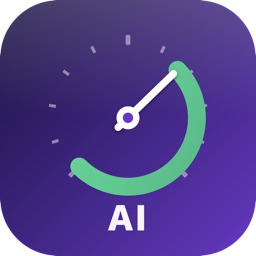

# AI Taskbar

<p align="center">
  
</p>

<p align="center">
  <b>Native macOS menu-bar tracker for LLM usage across 8 providers.</b><br/>
  Anthropic Claude · OpenAI Codex/ChatGPT · OpenRouter · Z.AI (GLM) · Kimi (Moonshot) · Gemini · DeepSeek · xAI (Grok) · Jev (TypeSafe)
</p>

<p align="center">
  <a href="https://github.com/justoeu/ai-taskbar/releases"></a>
  <a href="LICENSE"></a>
  
  
  
</p>

---

## What you get

A gauge icon in your menu bar showing the **highest utilization** across your LLM providers. It reflects only the **expanded (open) cards** in the popover — collapse a provider's card to drop it out of the gauge, so you can focus the number on the subscriptions you actually care about. Click it for a per-provider breakdown:

- **Plan label** ("Claude Max 20x", "ChatGPT Plus", "GLM Lite")
- **Per-window utilization** with color thresholds (green → yellow → red) — for Claude this includes the 5-hour session, 7-day weekly, any **per-model weekly windows** (e.g. Fable), and a **usage-credits** meter (shown with the money spent/limit, e.g. `R$556.68 / R$600.00`). Model windows are parsed generically from the API's `limits[]`, so a newly-launched model appears without an app update.
- **Reset countdown** ("resets 4 hrs, 12 min"; once the reset passes it shows "reset due — awaiting auto-refresh…" instead of counting back up)
- **24-hour sparkline** with dashed threshold lines, current value, and peak marker (one sample per live network reading; cached or stale replays are not re-plotted)
- **Daily + 7-day cost estimates** computed locally from your CLI logs (7 days = today plus the six previous local days, the same window for every source)
- **Per-model breakdown** ("opus-4-7 $1850 / haiku-4-5 $245"), priced from the official per-model rates — including prompt-cache reads/writes and the **fast-mode premium** on Opus 5.5, Opus 5 and Opus 4.8 (see [Cost estimates](#cost-estimates--claude-pricing))
- **Pin LLMs to the menu bar** — each pinned provider gets its own icon + % next to the main gauge, with reset countdowns in its tooltip; click it to jump to that card (see [Pinned LLMs](#pinned-llms-in-the-menu-bar))
- **Update banner** — a background check at every launch (at most once per 5 minutes) and once per calendar day while running shows "New version available" in the popover, with one-click download
- **opencode usage attributed to the vendor that billed it** — opencode is a client, not a provider, so its traffic shows up under OpenAI or xAI with its own line. Subscription traffic (ChatGPT-plan models) shows tokens rather than dollars, because no money moves; pay-per-token traffic shows the cost opencode itself recorded, as a breakdown of the total the vendor's API already reports — never added on top of it
- **Consumption & Analytics view** — usage share and cost share across LLMs for Today / Week / Month. Cost covers only what the local scanners keep (today and the last 7 days), so **Month shows usage but no cost** rather than relabelling the 7-day figure, and never calls a vendor idle ("no recent usage") for lack of a cost it cannot see. Today and Week, including sessions and the "vs previous period" delta, use the same local calendar days as the cost (today since midnight; today plus the six previous days). OpenRouter's 30-day activity and xAI's billing-cycle spend stay on their own cards, which name those windows, and are never counted as 7-day cost. Vendors without a session counter show the number of models used, not "sessions"
- **Service health & status monitor** — Live popover panel monitoring upstream operational status, active incidents, and scheduled maintenance across providers (Claude, OpenAI, Gemini, Grok, DeepSeek, Kimi, OpenRouter) with direct links to official status pages
- **Click the card header** (chevron + name + empty space) to expand/collapse; dashboard / reorder / refresh stay on the trailing buttons
- **Reorder cards** with ↑ / ↓ on each header (order saved on this Mac)
- **Locked card with explanation** when a provider has no credentials (with helpful guidance for local CLI requirements on Gemini and Grok)

The app runs entirely on-device — **no telemetry, no remote logging, no auto-update without your click**.

## Table of contents

- [Install](#install)
- [Setup per provider](#setup-per-provider)
- [Service status & health pages](#service-status--health-pages)
- [Pinned LLMs in the menu bar](#pinned-llms-in-the-menu-bar)
- [Cost estimates & Claude pricing](#cost-estimates--claude-pricing)
- [What's in this version](#whats-in-this-version)
- [How it works](#how-it-works)
- [Configuration](#configuration)
- [Where data lives](#where-data-lives)
- [Privacy & security](#privacy--security)
- [Build from source](#build-from-source)
- [Releasing a new version](#releasing-a-new-version)
- [Architecture](#architecture)
- [Contributing](#contributing)
- [License](#license)

## Install

### Option 1 — Download the DMG (recommended)

1. Download the DMG matching your Mac from [Releases](https://github.com/justoeu/ai-taskbar/releases):
   `ai-taskbar-X.Y.Z-arm64.dmg` (Apple Silicon, smaller) or the universal
   `ai-taskbar-X.Y.Z.dmg` (Intel + Apple Silicon).
2. Open the DMG and drag **AI Taskbar.app** to **/Applications**.
3. **First launch** — release DMGs are Developer ID-signed and notarized by
   Apple, so they open with no Gatekeeper warning. (Only ad-hoc DMGs from
   old releases or local `make dmg` builds warn; bypass with right-click →
   Open, or `xattr -dr com.apple.quarantine /Applications/AiTaskbar.app`.)

### Option 2 — Build from source

```bash
git clone https://github.com/justoeu/ai-taskbar.git
cd ai-taskbar
make app              # host arch only — fast for dev
make app-universal    # arm64 + x86_64 fat binary
open build/AiTaskbar.app
```

The app runs on macOS 13+ (Ventura). Building the app requires Swift 6.2+; Command Line Tools is enough. Running the tests requires **full Xcode** and the macOS version supported by its bundled Testing framework (validated with Xcode's Swift 6.3.3). CLT 6.3.2 cannot reliably locate its bundled Testing framework/runtime.

### Option 3 — Check for updates from inside the app

Click the gauge icon → ⓘ About → **Procurar atualizações** / **Check for updates**. The button hits `github.com/justoeu/ai-taskbar/releases/latest` directly (or the release list when `include_prereleases = true`, picking the newest non-draft by SemVer precedence, so `beta10` beats `beta9`), compares semver against your installed version, and offers a one-click DMG download that opens in Finder for you to drag to /Applications.

The app also checks on its own: at every launch (unless it checked less than 5 minutes ago, to stay within GitHub's API limit), and once per calendar day while running — at the start of each new day, or 24 h after the last check, whichever comes first. Only published releases count; drafts are never offered. It only reports what it finds; nothing is downloaded without your click. An invalid `owner_repo` counts as that day's attempt (About shows the error), so it is retried the next day, not every minute. `[updates] enabled = false` turns this off.

The download only follows redirects to GitHub's release hosts. Before the DMG is shown, the app checks it against the release's `checksums-*.txt` (a release without one is refused), confirms the app inside is signed by the same Developer ID team as the installed app, and marks the file with `com.apple.quarantine` so Gatekeeper checks it when you open it. If any step fails, the download is deleted.

## Setup per provider

The app **reads existing credentials** — you don't need to paste API keys for the OAuth-based ones.

| Provider | Source | Setup |
|---|---|---|
| **Claude** | macOS Keychain entry `Claude Code-credentials` | Run `claude auth login`; use the in-app Keychain authorization when requested |
| **Codex / ChatGPT** | `~/.codex/auth.json` | Run `codex login`. Zero setup after the CLI creates the file. |
| **OpenRouter** | API key | Add `api_key = "sk-or-v1-..."` to `[openrouter]` in config |
| **Z.AI (GLM)** | API key | Add `api_key = "..."` to `[zai]` in config |
| **Kimi (Moonshot)** | API key | Add `api_key = "sk-..."` to `[kimi]` in config |
| **DeepSeek** | API key | Add `api_key = "sk-..."` to `[deepseek]` in config |
| **Gemini** | Antigravity CLI (`agy`) or API key | **Requires local CLI:** Run `agy` to authenticate (required for live quota/usage monitoring). Fallback: API key in `[gemini]` for heartbeat only. |
| **Jev (TypeSafe)** | API key | Settings → Jev (TypeSafe) → paste the key (create it at [console.typesafe.ai](https://console.typesafe.ai)). Off until a key is saved. Optional: **Sign in to TypeSafe…** on the card or in Settings adds spend, balance and tokens. See [TypeSafe](#typesafe-jev--api-key-plus-optional-console-sign-in). |
| **xAI (Grok)** | Grok CLI (`~/.grok/auth.json`) or Management API | **Requires local CLI:** Run `grok login` (required for SuperGrok quota & balance). Fallback: Management key + `team_id` in `[xai]` for team API billing. |

> ⚠️ **macOS env vars footgun:** GUI apps launched from Finder do **not** inherit your shell environment. If you set `OPENROUTER_API_KEY=...` in `~/.zshrc`, the menu bar app **won't see it**. Three workarounds:
> 1. **Put the key directly in `config.toml`** (file is `chmod 600`).
> 2. Launch from a terminal: `OPENROUTER_API_KEY=sk-... open /Applications/AiTaskbar.app`.
> 3. Set it globally: `launchctl setenv OPENROUTER_API_KEY "sk-..."` (until reboot).

### OAuth recovery — **Authorize** vs **Re-login**

These buttons solve different failures and are intentionally kept separate:

| Failure | What the card shows | What the button does |
|---|---|---|
| macOS blocks AI Taskbar from silently reading Claude Code's Keychain item (`errSecInteractionNotAllowed` / `errSecAuthFailed`) | **Authorize** | Requests a native read of the exact selected item; macOS owns the authorization dialog and ACL updates. Success requires a verified silent read. The password never enters the app. |
| Claude or ChatGPT rejects an existing OAuth access token with HTTP 401 | **Re-login** | Delegates login to the CLI that owns the shared credential: `claude auth login` for Claude or `codex login` for Codex/ChatGPT. The CLI opens the browser and writes the renewed credential. |

The 401 banner appears inside the expanded provider card. AI Taskbar does not
rotate a shared refresh token in its default read-only mode. After **Re-login**
starts, it automatically retries the provider after 30 and 75 seconds; changes
to Codex's `~/.codex/auth.json` also trigger an immediate debounced refresh. If
the command cannot be launched, the card displays it so it can be copied and
run manually. When cached usage exists, it remains visible as stale data while
authentication is being repaired.

An API-key provider does not get a **Re-login** button for 401 responses: its
recovery is to replace the invalid key in `config.toml` or the configured
environment variable.

### Claude Code on macOS — Keychain access

Claude Code stores its OAuth token in the macOS Keychain, not in a user-readable
file like Codex's `~/.codex/auth.json`. The item is created for Claude Code's
own signing identity. Scheduled refreshes never display a surprise password
dialog: when macOS blocks a silent read, click **Authorize** in the Claude card.
That user-initiated action requests a read of the exact selected item, letting
macOS authorize the stable signed AI Taskbar identity through its native dialog; choose **Always Allow** if offered. The app never receives or
stores the Keychain password and reports success only after verifying a
silent read. Subsequent launches can reuse that authorization while Claude
Code preserves the item and its access controls. AI Taskbar never copies the
token to disk.

An `errSecAuthFailed` (-25293) during authorization does **not** establish that
the password is wrong. Earlier builds attempted to edit the protected partition
list directly with `SecKeychainItemSetAccess`, whose prompt credentials cannot
authorize that operation. An ACL-only commit can also succeed without making a foreign item readable.
The app now requests native read authorization and lets securityd manage that
list, without a Terminal command or manual ACL replacement. See Apple's implementation of
[ACL editing](https://github.com/apple-oss-distributions/Security/blob/main/securityd/src/acls.cpp)
and [native authorization](https://github.com/apple-oss-distributions/Security/blob/main/securityd/src/acl_keychain.cpp).

If several account-bearing Claude entries exist and none has previously been
resolved, authorization stops without changing any ACL instead of guessing
which credential is active. Set `keychain_account` in Anthropic settings and
click **Authorize** again.

If native authorization cannot persist, the card reports verification failure.
Managed Keychain policies may require help from the device administrator.
No Terminal command or Keychain password collection is part of onboarding.

**Why the prompt used to come back after every rebuild.** macOS records the
*code signature* of the app you authorized, not its name. An ad-hoc-signed
build (`make dmg`, or `make app` on a machine without a Developer ID
certificate) has a per-build `cdhash` identity, so every rebuild or update is a
"new app" to the Keychain and the banner reappears. A Developer ID build has a
stable identity (`identifier "dev.aitaskbar.app"` + team ID) and is authorized
once for all future versions. Run the notarized `/Applications/AiTaskbar.app`
for day-to-day use.

**Read-only fallback through `/usr/bin/security`.** When the direct read
fast-fails on the ACL, AI Taskbar now asks Apple's `security` tool for the
exact item (`find-generic-password -s <service> -a <account> -w`). Claude Code
writes the item with that same tool, so it is always on the item's trusted-app
list; the read succeeds silently regardless of how AI Taskbar itself is signed,
and the card shows usage instead of the Authorize banner. The child runs under a
5 s budget (a hung tool means securityd raised a dialog on its behalf; the
child is killed, which dismisses it, and the fallback pauses for an hour — five
minutes after an ordinary failure), is skipped while the keychain is locked
(that would be the unlock dialog), and is never used for writes; while a
credential comes from the fallback the app also never rotates the OAuth token,
even with `manage_oauth_refresh = true`. Authorize still works and restores the direct path.

### Claude `429 rate_limit_error`

When the warning tooltip contains Anthropic's JSON with
`"type": "rate_limit_error"`, the server really returned HTTP 429; it is not a
snapshot-decoding error. AI Taskbar keeps showing the last cached snapshot and
applies a per-provider exponential cooldown of 5, 10, 20, 40, then 60 minutes.
Other providers keep their normal schedule, and manual refresh cannot bypass
the affected provider's active cooldown. The existing scheduler also adds its
short 60-second global settling delay after a 429 cycle. If 429s persist, you
can still increase `[ui] refresh_interval_seconds` from `300` to `900` or
`1800`. The subscription usage endpoint is undocumented and Anthropic publishes
no polling quota for it, so the app cannot calculate an exact retry time unless
the response supplies one.

### OpenAI / Codex — credits are a quantity, not money

Codex reports paid usage credits as a bare decimal with **no currency symbol**:
the wire literally carries `"balance": "4890.3162520000"`. Earlier builds parsed
it with a `parseDollar` helper, stored it as `creditsUSD` and rendered
`Credits: $4890.32`, inventing a `$` the API never sent. Nothing in the app
formats credits as currency any more; the card shows a locale-formatted
quantity.

**Progress bar.** The payload reports only the *remaining* balance — there is
no granted total anywhere in it (`spend_control.individual_limit` and `promo`
are null on real accounts), so a percentage needs a denominator the app derives
itself: the highest balance it has ever observed, persisted per vendor in
`~/Library/Application Support/ai-taskbar/credits/<vendor>.json`. A balance
*above* that high-water mark can only be a top-up, which re-baselines the bar to
0%. **No bar is drawn until the baseline says something the balance does not**:
on the first sighting the peak *is* the balance, and a green 0% there would
tell someone who had already burned 90% of their credits that they had spent
nothing. The bar appears as soon as real consumption is observed, and is exact
after the next top-up. Unmetered accounts (`unlimited: true`) get no bar at
all, and a missing or garbled balance shows the plain number.

**Telling an expiry from ordinary spending.** A balance that falls is normally
consumption, but it is a grant change when a promotional block expires — and
from the number alone the two are identical. Rather than guess from the size of
the drop (a heuristic that would mistake a heavy day for an expiry and vice
versa), the app reads the two epoch signals the payload actually carries:
`has_credits` going false then true means credits came back after running out,
and a `promo` object that was present and is now absent means a promotional
grant ended. Either one re-seeds the denominator from the current balance. Only
the *presence* of `promo` is used; its inner shape has never been seen
populated on a real account, so nothing reads inside it.

One case remains that no signal can catch: a promotional block shrinking while
other credits remain, which looks exactly like spending. For that, right-click
the credits row and choose **Recalibrate credits bar** — it forgets the
baseline and re-seeds from the current balance on the next refresh.

The credits bar is deliberately **not** folded into the menu-bar percentage.
That number tracks plan windows which reset on a clock; credits drain on a
different axis against a locally-derived denominator, and mixing them would make
the menu bar read 80% because of credits while the plan sits at 10%.

**Credit-funded messages.** `approx_local_messages` and `approx_cloud_messages`
live *inside* the `credits` object, so both are estimates of what the remaining
credits still buy. They mean different things — the local Codex CLI versus cloud
tasks — and both are now shown, labeled as credit-funded. The old code collapsed
them into one English sentence built inside the provider (which is why a
Portuguese card showed `local msgs left`) and silently preferred whichever came
first. When the plan window is spent (`allowed: false`) and credits are covering
requests, the card says so instead of showing a bare red 100% bar that reads like
a block. "Requests are blocked" is claimed only when the plan window is spent
*and* the overage ceiling is hit — an overage ceiling on its own stops nothing
while the plan still has room. A drained balance says "credits used up" rather
than leaving a red bar unexplained.

### OpenAI / Codex — earned rate-limit resets

When a current, healthy usage snapshot reports an active window **above 90%**
and a positive earned-reset count, the OpenAI card offers **Use reset**. Clicking
checks availability again; a separate confirmation identifies the account and
explains that one earned reset will be consumed. Nothing runs automatically.

This requires a compatible official, OpenAI-signed Codex CLI (integration reference:
0.153.4). Older schemas, missing account identity or unavailable resets fail closed.
The external-token app-server API is experimental. AI Taskbar does not buy credits,
rotate the shared refresh token, or change the CLI's authentication file.

If a response is lost, **Retry same attempt** keeps the original idempotency key,
including across app restarts. A private `openai-reset-attempt.json` journal and
cross-process lock prevent separate local app instances from replacing a pending
attempt. See the [implementation SDD](docs/SDD-native-authorization-and-openai-reset.md)
for the protocol, security boundaries, tests and manual acceptance checks.

### xAI (Grok) — SuperGrok CLI monitoring & API team billing

> ⚠️ **Important requirement:** xAI does **not** provide a public REST API for querying individual SuperGrok / grok.com quotas or token balances. To monitor your SuperGrok usage and quota, you **must have the official Grok CLI installed and authenticated locally** (`grok login`).

AI Taskbar supports two modes for xAI:

1. **Grok CLI mode (default & recommended):**
   - **How it works:** AI Taskbar reads the local session credentials at `~/.grok/auth.json` (created upon running `grok login`) and queries Grok's internal billing proxy (`https://cli-chat-proxy.grok.com/v1/billing?format=credits` and `v1/settings`) using your authenticated Bearer token.
   - **What the card displays:**
     - **Subscription tier:** Identifies active tier (e.g. `SuperGrok Heavy`).
     - **Weekly quota window:** Current utilization percentage (e.g. `3% used`) and reset time.
     - **Prepaid balance:** Available balance (e.g. `$40.00 available`).
     - **Disclaimer:** An in-card informational notice reminds you, in the app's language, that Grok CLI must remain installed and logged in (e.g. *"To monitor Grok, Grok must be installed and authenticated."*).
   - **Setup:** Simply install the Grok CLI and run `grok login` in Terminal. No manual API keys or team IDs needed in `config.toml`.
   - **Recovery / 401:** If the token expires or is missing, the card displays a **Re-login** button that executes `grok login`.

2. **Management API mode (for team/developer spend):**
   - If you do not use the Grok CLI and wish to track developer API credit spend instead, set `prefer_grok_cli = false` under `[xai]` in `config.toml`.
   - Requires a **Management key** from [console.x.ai](https://console.x.ai) → Settings → Management Keys (not an inference API key) and your Team UUID (`team_id`).
   - Reads prepaid balance and current-cycle postpaid invoices from `management-api.x.ai`.

---

### TypeSafe (Jev) — API key, plus optional console sign-in

[Jev](https://docs.typesafe.ai) is TypeSafe AI's "System One" model: it returns typed decisions (choice, score, yes/no probability), not chat text. The card is **off until you save an API key** in Settings → Jev (TypeSafe).

- **What the card shows:** whether the key is accepted and which models it can call (`jev-latest`, `jev-preview`), from `GET /v1/models` — a call that costs nothing. The app never runs an evaluation (`/v1/systemone`), because every evaluation bills tokens and would appear in your own usage.
- **Spend, balance and tokens need a console sign-in:** TypeSafe's public API has no usage or billing endpoint for API keys; those numbers live in the [TypeSafe console](https://console.typesafe.ai/usage). Click **Sign in to TypeSafe…** on the card (or Settings → Jev (TypeSafe) → Console): the console's own login page opens in a private in-app window, you sign in as usual (Google, e-mail), and the window closes by itself. The card then shows the cycle spend and balance the console reports, live credits with their expiry, and today's / last 7 days' tokens and requests. Nothing to copy, no browser or terminal involved.
- **What is kept:** only the three login cookies (`session`, `session_id`, `organization_id`), encrypted in `config.toml` (0600), sent only to `console.typesafe.ai`, never logged or cached. The window uses a non-persistent store, so your browsers' cookies are never read. Personal data the console returns (e-mail, billing address, payment method, key names) is never decoded. The session lasts ~14 days; the card warns two days before and offers **Sign in again**. **Sign out** in Settings deletes it.
- **No menu-bar percentage:** there is no quota to measure, so the provider can't be pinned and never moves the menu-bar gauge.
- **Status:** incidents from [status.typesafe.ai](https://status.typesafe.ai). Its feed publishes one item per update, so updates are merged per incident, and an unresolved incident with no update for 48 h is treated as abandoned rather than ongoing.
- **Pricing (for reference, not used by the app):** US$ 0.042 per million input tokens, output free ([docs.typesafe.ai/models](https://docs.typesafe.ai/models), checked 2026-09-29).

### Google Gemini — Antigravity CLI monitoring & heartbeat

> ⚠️ **Important requirement:** Google does **not** provide a public REST API for personal Gemini subscription quotas (such as the 5-hour or weekly consumer limits on gemini.google.com). To monitor Gemini quotas and models, you **must have Google's Antigravity CLI (`agy`) installed and authenticated locally**.

AI Taskbar supports two monitoring paths for Google Gemini:

1. **Antigravity CLI mode (default & recommended):**
   - **How it works:** AI Taskbar executes the local Antigravity CLI in the background (`agy --output-format json --print "/usage"`) with a 35-second budget, closed standard input, stdout capped at 4 MiB (a larger answer is rejected, not parsed) and stderr truncated to 64 KiB.
   - **Binary auto-detection:** Automatically discovers `agy` in standard install paths:
     - `~/.local/bin/agy`
     - `/opt/homebrew/bin/agy`
     - `/usr/local/bin/agy`
     - `~/.gemini/antigravity/bin/agy`
     - Or specify an explicit path via `agy_path = "/path/to/agy"` under `[gemini]` in `config.toml`.
   - **What the card displays:**
     - **Gemini (5h):** Session quota window utilization and remaining fraction.
     - **Gemini (Weekly):** Weekly quota window utilization and reset countdown.
     - **Third-party models (5h & Weekly):** Tracks secondary quotas for third-party models accessed through Antigravity (e.g. Claude).
     - **Disclaimer:** When Antigravity is unauthenticated or missing, the card shows a clear notice in the app's language (e.g. *"To monitor Gemini quotas, Antigravity must be installed and authenticated."*). A quota bucket that `agy` reports without a `remaining_fraction` draws no bar rather than being shown as 100% remaining.
   - **Setup:** Install the Antigravity CLI and log in by running `agy` in Terminal.
   - **Recovery / 401:** If the session is unauthenticated, clicking the **Re-login** button runs `agy` in Terminal to re-authenticate.

2. **API Key Heartbeat (fallback):**
   - If you do not use Antigravity, you can set `prefer_antigravity = false` and supply a Google AI Studio API key (`api_key = "AIza..."` or `GEMINI_API_KEY`).
   - Acts strictly as an authenticated heartbeat (`GET /v1beta/models`) to check key validity and count available models. Developer keys do not expose subscription usage or remaining quotas.

---

## Service status & health pages

AI Taskbar features an integrated **Service Status & Health Dashboard** that monitors upstream operational availability, active incidents, and scheduled maintenance across supported providers.

- **How to open:** Click the status indicator icon in the popover header to open the dedicated status window.
- **6-hour sliding window:** Tracks incidents within the `[now - 6h, now]` interval, displaying progress phases (Investigating, Identified, Monitoring, Resolved).
- **Aggregated health:** Evaluates overall service state using worst-case severity (Operational, Degraded Performance, Partial Outage, Major Outage).
- **Official status sources:**

| Provider | Official Status Page | Integration Type |
|---|---|---|
| **Anthropic (Claude)** | [status.claude.com](https://status.claude.com) | Statuspage API |
| **OpenAI (ChatGPT/Codex)** | [status.openai.com](https://status.openai.com) | Statuspage API |
| **Google Gemini / AI Studio** | [aistudio.google.com/status](https://aistudio.google.com/status) | Official Health Page |
| **xAI (Grok)** | [status.x.ai](https://status.x.ai) | RSS Status Source |
| **DeepSeek** | [status.deepseek.com](https://status.deepseek.com) | Status API |
| **Kimi (Moonshot)** | [status.moonshot.cn](https://status.moonshot.cn) | Statuspage API |
| **OpenRouter** | [status.openrouter.ai](https://status.openrouter.ai) | RSS Status Source |
| **Jev (TypeSafe)** | [status.typesafe.ai](https://status.typesafe.ai) | RSS Status Source (one item per update, merged per incident) |
| **Z.AI** | *(None)* | Unmonitored (no public status page) |

Clicking any row in the status window opens the provider's official status page directly in your browser.

---

## Pinned LLMs in the menu bar

Expand a provider's card and turn on **Pin to menu bar**. The provider gets its own item — its icon plus the current %, or weekly and session % stacked for providers that report both — rendered in the same system menu-bar font as the main gauge.

- **Order:** the first pin sits immediately left of the main gauge; each later pin goes one slot further left. Unpinning and re-pinning puts the provider back at the end of that sequence.
- **Click** a pinned item to open the popover focused on that provider's card; click it again to close.
- **Tooltip:** hover for the provider's windows and their daily / weekly reset countdowns.
- **Space limit:** macOS hides menu-bar items that don't fit, so pinning is refused — with an explanation — when the next item would collide with the camera notch (or cover the app menus on displays without one), and after 5 pins. The check measures the real bar and the widest a badge can grow, so on a 14" MacBook with many system icons you may only have room for two.
- The check runs when you pin. If another app later adds icons, macOS may still hide the leftmost ones; unpin one to make room.

## Cost estimates & Claude pricing

Daily and 7-day costs are computed **locally** from the CLI transcripts (`~/.claude/projects`, `~/.codex/sessions`, opencode's database) and the per-model price table in `PricingTable.swift`, checked against the vendors' published rates (Claude: [platform.claude.com pricing](https://platform.claude.com/docs/en/about-claude/pricing), last verified 2026-10-10).

| Claude model | Input | Output | Cache write 5m / 1h | Cache read | Fast mode (in / out) |
|---|---|---|---|---|---|
| Opus 5.5 | $4 | $20 | $5 / $8 | $0.20 | $8 / $40 |
| Opus 5 · Opus 4.8 | $5 | $25 | $6.25 / $10 | $0.50 | $10 / $50 |
| Sonnet 5.5 | $2 | $10 | $2.50 / $4 | $0.10 | — |
| Sonnet 5 | $2 | $10 | $2.50 / $4 | $0.20 | — |
| Haiku 5.5 (prompt ≤ 100K) | $0.10 | $0.50 | $0.125 / $0.20 | $0.01 | — |
| Haiku 5.5 (prompt > 100K) | $0.50 | $2.50 | $0.625 / $1 | $0.05 | — |

Prices per million tokens. **Fast mode** keeps the same model id, so it is detected per request from the transcript's `usage.speed` and billed at 2x on every token category, cache included. Models without fast mode (Opus 4.7 rejects it, Opus 4.6 runs it at standard price) are billed at standard rates. **Haiku 5.5** is priced by prompt length: a request whose prompt (input + cache reads + cache writes) is over 100,000 tokens is billed entirely at the higher row, output included. A model missing from the table still appears in the breakdown, marked as not yet priced, rather than disappearing.

**Gemini 4 (Argon)** is priced provisionally under a `gemini-4` prefix at its announced introductory rate ($2 / $10, cached input $0.10): as of 2026-10-10 it has no public model ID and is not on Google's official price list.

---

## What's in this version

### v0.23.7 — Deep audit: truthful Claude cost, safer updates

- **Claude cost ~1.9x too high, fixed:** Claude Code writes each API response to its transcript several times; the scanner now counts each response once (`message.id` + `requestId`).
- **Analytics:** opencode dollars are no longer added to vendor totals; Month shows a truthful cost; Day and Week use calendar days.
- **Safer in-app updates:** the release checksum is required, the DMG is quarantined, and Developer-ID builds verify the app inside is signed by the same team.
- **Update checks** run at every launch (at most once per 5 minutes) and once per calendar day while running.
- Localized Gemini/Grok notices, notification titles and tooltips; tighter file permissions, response size caps and single-flight OAuth refresh. Full list: `docs/audits/deep-audit/2026-09-29-full/REPORT.md`.

### v0.23.6 — Pinned LLMs fixed on macOS 26, Claude 5.5 pricing, fast mode

- **Pinned LLMs appear, in order:** a re-pinned provider could be created but never drawn, and a pin could land on the wrong side of the main gauge. Both came from macOS 26 status-item behavior, now measured and handled (stable item identity; pins are created only after the main gauge is on the bar).
- **Real space limit:** the notch check no longer gives up when it can't find the main gauge, and it measures the badge instead of guessing it — no more pins sliding under the notch or overlapping.
- **Consistent look:** pinned percentages use the same system font as the main gauge (no larger, no bold).
- **Claude pricing:** Opus 5.5 corrected to $4 / $20 (it had been billed at the Opus 5 rate — 25% too high, cache reads 2.5x); Sonnet 5.5 added; fast mode priced as a 2x premium on Opus 5.5, Opus 5 and Opus 4.8.

### v0.21.0 – v0.23.5 — Analytics dashboard, pinned LLMs, update banner

- **v0.21.0:** consumption & analytics dashboard, pin LLMs to the menu bar, active-session counters, latency optimizations.
- **v0.22.0:** daily background update check with an in-popover update banner.
- **v0.23.0:** daily and weekly reset countdowns in pinned-LLM tooltips.
- **v0.23.1:** OpenRouter balance/quota semantics fixed; analytics comparison delta explained in context.
- **v0.23.2 – v0.23.5:** successive pinned-item fixes (ordering, flicker, notch limit), superseded by v0.23.6.

### v0.20.0 — Gemini Antigravity, Grok CLI SuperGrok quotas, service health and settings indicators

- **Google Gemini via Antigravity CLI (`agy`):** Real-time monitoring of 5-hour and weekly quota windows for Gemini and third-party models using local `agy` execution with automatic binary discovery.
- **xAI / Grok CLI integration:** SuperGrok Heavy subscription tier, weekly usage %, reset countdown, and prepaid balance via `~/.grok/auth.json` and Grok billing proxy.
- **Vendor installation disclaimers:** Clear, helpful disclaimers in Gemini and xAI cards highlighting that local CLIs must be installed and logged in.
- **Service Status & Health Panel:** Dedicated panel tracking upstream outages, maintenance, and incident history across all providers with links to official status pages (including Google AI Studio and status.x.ai).
- **Settings redesign:** Clear visual active/enabled indicators with green checkmarks and distinct styling for active providers.

### v0.19.0 — Codex credits quantity, self-correcting baseline

- **Codex credits as a quantity:** Parse and display OpenAI credits as a bare quantity rather than fabricating currency symbols. Progress bar reflects locally observed peak baseline from `CreditBaselineStore`.
- **Self-correcting credit baseline:** Fall-drop heuristics avoid mistaking natural usage for grant expiration; recalibrate baseline option surfaced via context menu.
- **Structured message ranges:** Separate `approx_local_messages` and `approx_cloud_messages` preserved for credit-funded accounts without hardcoded strings.

For older releases, see [CHANGELOG.md](CHANGELOG.md) or [GitHub Releases](https://github.com/justoeu/ai-taskbar/releases).

## How it works

```
┌─────────────────────────────────────────────────────────────┐
│                  AiTaskbarApp (SwiftUI)                     │
│  ┌────────────────────┐    ┌────────────────────────────┐  │
│  │  MenuBarExtra      │    │  UpdateChecker             │  │
│  │  (gauge icon + %)  │    │  (GitHub Releases)         │  │
│  └─────────┬──────────┘    └────────────────────────────┘  │
│            │                                                │
│  ┌─────────▼──────────┐    ┌────────────────────────────┐  │
│  │  PopoverContentView│    │  AboutView                 │  │
│  │  + VendorSection   │    │  (version + l10n + updates)│  │
│  └─────────┬──────────┘    └────────────────────────────┘  │
└────────────┼────────────────────────────────────────────────┘
             │
┌────────────▼────────────────────────────────────────────────┐
│                  UsageStore (coordinator)                   │
│  Holds N × VendorViewModel (per-vendor @ObservableObject).  │
│  maxUtilization = max over EXPANDED cards → menu bar gauge. │
│  sortedVendors = user order (↑/↓) or configured-first.      │
└────────────┬────────────────────────────────────────────────┘
             │
┌────────────▼────────────────────────────────────────────────┐
│              N × Provider (UsageProvider impl)              │
│              All use CachedFetch helper:                    │
│  ┌──────────────────────────────────────────────────────┐  │
│  │ 1. Cache check (300s TTL → no network)               │  │
│  │ 2. Credentials read (Keychain / file / env+config)   │  │
│  │ 3. OAuth refresh if needed (shared OAuthRefresher)   │  │
│  │ 4. HTTP request                                      │  │
│  │ 5. Decode wire types (lenient int/float)             │  │
│  │ 6. Persist payload to cache (atomic, 0o600)          │  │
│  │ 7. Fallback to stale cache on any error              │  │
│  └──────────────────────────────────────────────────────┘  │
└────────────┬────────────────────────────────────────────────┘
             │
┌────────────▼────────────────────────────────────────────────┐
│  AiTaskbarCore                                              │
│  Networking (HTTPClient w/ optional pinning) ·              │
│  Cache (DiskCache + AtomicFileWrite) ·                      │
│  Credentials (Keychain, File, EnvOrConfig) ·                │
│  Config (TOMLKit) · Cost (ClaudeSessionScanner +            │
│  CodexSessionScanner/CodexCost + PricingTable) ·            │
│  History (UsageHistoryStore — JSONL append + compact 24h)   │
└─────────────────────────────────────────────────────────────┘
```

The **`RefreshScheduler`** fires every `refresh_interval_seconds` (default 300s = 5 min — chosen as a balance between freshness and being polite to the Anthropic / Z.AI / Codex usage endpoints, which rate-limit aggressively below ~60s) and triggers `UsageStore.refreshAll()`, which fans out to each `VendorViewModel`. Per-vendor state updates only invalidate that vendor's `VendorSectionView` — no fan-out re-renders.

If any vendor's last refresh ended in HTTP 429, the scheduler adds **`RefreshScheduler.rateLimitBackoff` = 60 s** to the next sleep. The back-off is read via `UsageStore.hasRateLimitedVendor` between cycles and stays applied for as long as at least one vendor keeps returning 429 — once they clear, the cadence drops back to the configured interval automatically. During the back-off the popover countdown shows "Aguardando rate-limit…" (anchored on `UsageStore.isInRateLimitBackoff`) so the header never silently freezes at 0:00. Independently, each `VendorViewModel` tracks consecutive 429s and refuses new network work until its own 5/10/20/40/60-minute cooldown expires; this keeps a throttled provider from blocking normal refreshes for the others.

Every usage window's percentage is sanitized when it is built and again when it is read back from the cache: NaN becomes 0 and the value is clamped to 0–1000%, so a vendor reporting overuse still shows above 100% but a corrupt or hostile number cannot reach the bars or the menu-bar gauge.

The per-vendor `DiskCache` TTL is wired to `max(15, refresh_interval_seconds − 5)` in `AppEnvironment`. The 5 s margin means a scheduled tick at T=interval always sees an expired cache (`age ≈ interval > ttl`), so the scheduler doesn't need `forceRefresh: true` to defeat the cache. Popover opens between scheduled refreshes still serve from cache.

## Configuration

Lives at `~/Library/Application Support/ai-taskbar/config.toml`. The app auto-creates and tops up missing sections on launch (your edits are preserved). Click **Config** in the popover footer to open it.

Full schema in [`config.example.toml`](config.example.toml). Highlights:

```toml
[ui]
# primary = "anthropic"              # which vendor opens first
# menu_bar_mode = "icon_and_percent"   # icon | icon_and_percent | rotating
# refresh_interval_seconds = 300     # default 300 (5m). Floor 15. Common: 60, 150, 300, 600.
# language = "pt-BR"                 # force UI language (en | pt-BR | es)

[thresholds]
warning  = 70                        # green → yellow above this
critical = 90                        # → orange/red above this

[notifications]
enabled   = true
notify_at = [90, 100]                # percent thresholds that trigger a notification
# discreet = true                    # hides vendor name from lock-screen previews

[updates]
# enabled = true
# owner_repo = "justoeu/ai-taskbar"  # GitHub <owner>/<repo>
# include_prereleases = false        # true: also offer the newest beta/rc

[security]
# pin_hosts = ["api.anthropic.com", "chatgpt.com", "openrouter.ai", "api.z.ai", "api.moonshot.ai", "api.deepseek.com", "management-api.x.ai", "api.typesafe.ai"]
# pin_audit_only = false

[anthropic]
enabled = true
# keychain_account = "your.short.username"   # pin if you have multiple Claude entries
# manage_oauth_refresh = false   # default false: read-only, lets Claude Code own token renewal

[openai]
enabled = true
# codex_auth_path = "/Users/you/.codex/auth.json"
# manage_oauth_refresh = false   # default false: read-only, lets the Codex CLI own token renewal

[openrouter]
enabled = true
api_key_env = "OPENROUTER_API_KEY"
# api_key = "sk-or-v1-..."

[zai]
enabled = true
api_key_env = "ZAI_API_KEY"
# api_key = "..."
# plan_tier = "lite"                 # lite | pro | max

[kimi]
enabled = true
api_key_env = "MOONSHOT_API_KEY"
# api_key = "sk-..."
# base_url = "https://api.moonshot.ai/v1"   # or https://api.moonshot.cn/v1

[gemini]
enabled = true
prefer_antigravity = true        # default true: queries local 'agy' CLI for live quota windows
# agy_path = "/path/to/agy"     # optional: custom path if not in standard locations
api_key_env = "GEMINI_API_KEY"  # fallback heartbeat if Antigravity is not installed
# api_key = "AIza..."

[deepseek]
enabled = true
api_key_env = "DEEPSEEK_API_KEY"
# api_key = "sk-..."
# base_url = "https://api.deepseek.com"

[typesafe]
enabled = false                 # switched on when you save a key in Settings
api_key_env = "TYPESAFE_API_KEY"
# api_key = "..."               # stored encrypted
# base_url = "https://api.typesafe.ai"   # only this host is accepted
# console_session / console_session_expires_at are written by
# "Sign in to TypeSafe…" (encrypted); do not edit them by hand.

[xai]
enabled = true
prefer_grok_cli = true          # default true: reads ~/.grok/auth.json for SuperGrok Heavy quota
# grok_auth_path = "/Users/you/.grok/auth.json"
# grok_base_url = "https://cli-chat-proxy.grok.com"   # host-allowlisted; anything else falls back
# Management API fallback (if prefer_grok_cli = false):
# api_key_env = "XAI_MANAGEMENT_KEY"
# api_key = "xai-..."
# team_id = "xxxxxxxx-xxxx-xxxx-xxxx-xxxxxxxxxxxx"
# base_url = "https://management-api.x.ai"
```

Each `notify_at` threshold notifies once per usage window. A notification that macOS failed to deliver is retried on the next refresh; one that failed while notifications were turned off for the app is sent on a later refresh once you allow them again.

## Where data lives

| Path | What | Perms |
|---|---|---|
| `~/Library/Application Support/ai-taskbar/config.toml` | Your settings | `0600` |
| `~/Library/Application Support/ai-taskbar/history/<vendor>.jsonl` | 7 days of max-utilization samples (sparkline) | `0600` |
| `~/Library/Application Support/ai-taskbar/pins/<host>.txt` | TLS pin hashes (only if pinning enabled) | `0600` |
| `~/Library/Caches/ai-taskbar/<vendor>/usage.json` | Last cached API response (OpenAI has PII stripped) | `0600` |

The app never writes credential payloads outside these locations. The explicit
Claude **Authorize** action normally updates only access-control metadata on the
existing `Claude Code-credentials` Login Keychain item. When the opt-in
`manage_oauth_refresh = true` mode already holds a newer rotated token whose
write was ACL-blocked, authorization also reconciles that pending value back to
the same item. No telemetry, no remote logging.

## Privacy & security

- Anthropic OAuth tokens stay in the **Keychain** — the app reads them, never copies them to disk.
- **The OAuth providers are read-only by default** (`[anthropic] manage_oauth_refresh = false` and `[openai] manage_oauth_refresh = false`). A usage monitor shares the `Claude Code-credentials` Keychain item with the Claude Code CLI and `~/.codex/auth.json` with the Codex CLI, and both vendors rotate the refresh token on every exchange — so refreshing it here would invalidate the token other running CLI sessions hold (forcing "please re-login"), and the Anthropic write-back also trips a Keychain ACL prompt on ad-hoc builds. In read-only mode the app uses whatever token the CLI maintains and lets the CLI own renewal; if the token is briefly expired the last cached snapshot is shown until the CLI refreshes (on a cold cache with no prior snapshot the vendor tile shows the error until renewal). Set `manage_oauth_refresh = true` for a vendor only if you run AI Taskbar standalone without that CLI.
- Keychain reads **and** writes run under `KeychainPromptSuppressor` (`SecKeychainSetUserInteractionAllowed(false)` around every SecItem call) **in addition to** `kSecUseAuthenticationUI = kSecUseAuthenticationUIFail`. The UIFail hint alone only silences the trusted-app Allow/Deny confirmation — the partition-list **password** dialog ignores it and used to pop on every scheduled refresh from a binary the ACL didn't recognize. With both in place, a blocked binary fast-fails (`errSecInteractionNotAllowed` / `errSecAuthFailed`) instead of prompting; the renewed access_token is kept in memory and persistence retries on the next OAuth cycle. The log directs the user to the in-app Authorize button.
- When a scheduled read is blocked, the Claude card shows **Authorize**. Its sole interactive read targets one exact item. macOS owns consent; a silent same-item probe is mandatory. The reader binds subsequent reads and opt-in writes to that persistent reference, and never carries pending tokens onto a different or recreated credential.
- `make app` signs local builds with your **Developer ID Application** identity when the login keychain has one, so one Authorize covers subsequent signed rebuilds. The bundle assembly can fall back to ad-hoc signing, but durable authorization fails closed there because an ad-hoc identity cannot safely remain trusted across builds.
- Codex `~/.codex/auth.json` writes go through atomic tempfile with `0o600` set **before** the rename — no race window where fresh refresh tokens are world-readable.
- Configuration files (`config.toml`) and cache files are `chmod 0600`, support dir `chmod 0700`.
- **Inline secrets in `config.toml` are bound to this Mac.** Every `api_key` and the TypeSafe console session are stored as `enc:v2:` — AES-GCM with a key derived (HKDF-SHA256) from **this Mac's hardware UUID**, each value also bound to the field it lives in (a value copied into another field does not open). On launch, values still in plaintext or in the older `enc:v1:` format (key from the constant alone) are re-encrypted as `enc:v2:`; no backup copy is written (it would keep the plaintext on disk) — the rewrite is verified by re-reading it, and the original is put back if anything differs. On a new Mac or after a logic-board replacement the keys can no longer be read: the cards ask for them again and every other setting is kept. **What this protects:** the file on its own — pasted, shared on screen, attached somewhere, copied off the machine. **What it does not:** the UUID is not a secret (any local process, `ioreg`, System Information exports and Time Machine metadata expose it), so malware running as you, or someone holding a full image or Time Machine backup of this Mac, can derive the key. Copies made before the upgrade (older Time Machine snapshots, `config.toml.bak-*` files from "Restore defaults") still hold the old values; rotate those keys if that matters to you. The Keychain is deliberately not used here: it would prompt for your password and losing the item would lose every key.
- OpenAI cache strips `user_id`/`account_id`/`email` fields before persisting — only utilization data survives.
- `KimiConfig.base_url` is allow-listed against `api.moonshot.ai`/`api.moonshot.cn` to prevent API-key exfil via attacker-controlled config.
- `DeepSeekConfig.base_url` is allow-listed against `api.deepseek.com` for the same reason.
- `XAIConfig.base_url` is allow-listed against `management-api.x.ai` (management keys only; inference host `api.x.ai` is rejected).
- Optional **TLS pinning** with Trust-On-First-Use SPKI hashes for paranoid setups.
- Hardened-runtime entitlements ready for Developer ID signing (see [`Resources/entitlements.plist`](Resources/entitlements.plist)).
- TOCTOU symlink refusal on cache + support directories.
- Credential, config and cache writes (`AtomicFileWrite`) refuse a symlinked destination file: the write fails and both the link and its target are left untouched. For a symlinked `config.toml` this means new vendor sections are not appended on launch (the refusal is logged) and Settings cannot save; edit the link's target by hand.
- All audit findings from a 5-agent code review are tracked and addressed; see `CLAUDE.md` for the policy.

## Build from source

```bash
make app                # debug-quality release build, host arch (fast iteration)
make app-universal      # arm64 + x86_64 fat binary
make icon               # regenerate Resources/AppIcon.icns from Swift drawing script
make dmg                # host-arch DMG
make dmg-universal      # universal DMG
make validate           # runtime assertions + Swift Testing + coverage ≥90% + smoke launch + perms audit
make universal-check    # asserts the built app really is x86_64 + arm64
make sign-developer     # DEVELOPER_ID auto-detected when the keychain has exactly one
make notarize           # requires NOTARY_PROFILE (keychain) or APPLE_ID/APPLE_TEAM_ID/APPLE_PASSWORD
make release            # both notarized DMGs: arm64 + universal (sign app → DMG → sign DMG → notarize → staple)
make publish            # make release + upload both DMGs & checksums to the GitHub Release, flip draft → published
make ship               # full ritual: push → wait CI tag → pull bump → make publish
make clean
```

### Dependencies and testing

TOMLKit **0.6.0** is the only SwiftPM dependency; its embedded toml++ is **3.4.0**. Both remain at their latest published stable releases as checked on 2026-09-06. Tests use **Testing bundled with the selected Swift toolchain**, not a separately versioned `swift-testing` or `swift-syntax` package. This avoids mixing incompatible Testing runtimes and macros. See the [upstream distribution guidance](https://github.com/swiftlang/swift-testing/blob/main/Documentation/Distributions.md).

The Boolean assertion helpers have one canonical source at `Sources/AiTaskbarTestSupport/ExpectBool.swift`, compiled directly in each test target through relative symlinks. Keep those symlinks intact. Negative-control tests verify that deliberately false helper assertions are observed by the runner. After migrating an existing checkout, run `swift package clean` once before `make validate` to discard modules built against the former standalone package.

`make test`, `make coverage` and `make validate` preserve an explicit `DEVELOPER_DIR` or the selected full Xcode. When only CLT is selected, they use `/Applications/Xcode.app` if installed. This does not change the machine's global `xcode-select` setting or release commands. For another Xcode location, use `DEVELOPER_DIR=/path/to/Xcode.app/Contents/Developer make validate`. For direct `swift test` commands, select the full Xcode with the same environment variable.

### Customize bundle identifier

```bash
make BUNDLE_ID=com.yourorg.aitaskbar app
```

### Code-signed distribution (optional, requires paid Apple Developer ID)

```bash
# One-time: store the app-specific password (from account.apple.com) in the
# keychain so it never touches env vars or shell history:
xcrun notarytool store-credentials my-profile --apple-id you@example.com --team-id TEAMID12345

NOTARY_PROFILE=my-profile make release
```

This one-time step is per-machine, and without it every release builds both
DMGs and then stops at `notarize`. Check whether it was already done by
**using** the profile — never by searching the keychain:

```bash
xcrun notarytool history --keychain-profile my-profile
```

`Successfully received submission history` means it works. A keychain query
like `security find-generic-password -s "com.apple.gke.notary.tool"` returns
nothing **even when working profiles exist** — notarytool does not store them
where that looks, so its silence is a false negative, not an answer.

`DEVELOPER_ID` is auto-detected when the login keychain holds exactly one
`Developer ID Application` certificate. Set it explicitly when you have more
than one — the Makefile refuses to guess, because signing a release under the
wrong team only surfaces once notarization comes back attached to the wrong
account:

```bash
export DEVELOPER_ID="Developer ID Application: Your Name (TEAMID12345)"
```

(Alternatively pass `APPLE_ID` + `APPLE_TEAM_ID` + `APPLE_PASSWORD` env vars
instead of `NOTARY_PROFILE`.)

Result: a DMG that opens with **no Gatekeeper warnings** on any macOS 11+ Mac. Without this, you get the one-time warning described in [Install](#install).

## Releasing a new version

Tagging is **automatic**, publishing is **local**. Every push to `main`
(typically a PR merge) runs [`auto-tag.yml`](.github/workflows/auto-tag.yml),
which:

1. Picks the next version from the commit messages since the last tag.
2. Bumps the version in `Makefile`, `Bundler.toml`, `Resources/Info.plist`, and
   `AboutView.swift`, then commits `chore(release): vX.Y.Z [skip release]`.
3. Pushes an annotated `vX.Y.Z` tag.
4. Calls [`release.yml`](.github/workflows/release.yml), which validates the
   tagged commit and creates a **draft** GitHub Release with generated notes —
   no DMG is built in CI. The Developer ID private key never leaves the
   maintainer's Mac (no signing secrets in the repo).

The maintainer then publishes the assets locally. One command does the whole
ritual (push → wait for CI to tag → pull the bump → publish):

```bash
export DEVELOPER_ID="Developer ID Application: Your Name (TEAMID12345)"
NOTARY_PROFILE=my-profile make ship
```

(`make publish` is the second half alone, for when the tag already exists
locally; `ship` aborts cleanly if the head commit opted out via
`[skip release]`.)

`make publish` checks the signing identity and notarization credentials in its
first second — before building anything — then refuses to run on a dirty tree or
when `HEAD` isn't the tagged release commit. Once a later commit lands on
`main`, publish from the tag instead:

```bash
git checkout v0.16.1 && make publish && git checkout main
```

It then builds, signs and notarizes **two DMGs** —
`ai-taskbar-X.Y.Z-arm64.dmg` (Apple Silicon, smaller) and the universal
`ai-taskbar-X.Y.Z.dmg` — uploads both plus a `checksums-X.Y.Z.txt`, checks that the release now lists
all three (`make release-assets-check`), and only then flips the release from
draft to published. The in-app update checker picks the DMG
matching the user's architecture (drafts are invisible to it, so users never
see an asset-less release).

### Choosing the bump level

The level is matched against the commit subjects/bodies since the last `v*` tag:

| Bump  | Trigger                                                              |
|-------|---------------------------------------------------------------------|
| major | a body line **starting** with `BREAKING CHANGE:` (exact case), a `type!:` subject, or `[bump:major]` |
| minor | a `feat:` / `feat(scope):` subject, or `[bump:minor]`               |
| patch | anything else (the default — this repo uses free-form subjects)      |

To push to `main` **without** cutting a release (docs-only tweaks, etc.), put
`[skip release]` anywhere in the head commit message.

### Cutting one manually

You can still tag by hand (e.g. for a backfill or a pre-release):

```bash
git tag v0.2.0-beta1
git push origin v0.2.0-beta1
```

The [release workflow](.github/workflows/release.yml) runs on GitHub-hosted
macOS runners and does exactly two things:

1. Run the validation suite against the tagged commit.
2. Create a **draft** GitHub Release with auto-generated notes.

It builds **no DMG and attaches no asset** — that has been true since v0.7.3,
for the reason given above: the Developer ID private key stays on the
maintainer's Mac. Pushing a tag therefore gets you a draft and nothing else;
run `make publish` locally to put binaries on it.

Pre-releases: tag like `v0.2.0-beta1` — the workflow marks them as pre-release automatically.

## Architecture

```
AiTaskbarApp/             SwiftUI MenuBarExtra + popover + About + UpdateChecker
  ViewModels/             UsageStore (coordinator) + VendorViewModel (per vendor)
  Views/                  VendorSectionView (accordion), Sparkline, MenuBarLabel
  Localization/           L10n.swift + Resources/<lang>.lproj/Localizable.strings
AiTaskbarProviders/       8 providers — all use CachedFetch + OAuthRefresher helpers
AiTaskbarCore/
  Models/                 UsageSnapshot, FetchOutcome, AppError, VendorId
  Networking/             HTTPClient (ephemeral session), PinStore, PinningDelegate
  Cache/                  DiskCache (TTL+stale fallback), AtomicFileWrite
  Credentials/            Keychain, File, EnvOrConfig readers + JSONValue
  Config/                 AppConfig + ConfigLoader (TOMLKit) + flexibleDouble
  Cost/                   ClaudeSessionScanner, CodexSessionScanner,
                          CodexCost (source selection), CodexLogScanner
                          (legacy sqlite fallback), PricingTable
  History/                UsageHistoryStore (persistent JSONL + NSLock)
  Util/                   Paths, JWT, Semver, SharedCoders
AiTaskbarValidate/        Standalone runtime assertions (works with CLT-only setups)
AiTaskbarTesting/         Fixtures + StubURLProtocol (shared by tests + validate)
AiTaskbarTestSupport/     Canonical Boolean helpers, symlinked into tests (not an app target)
Tests/                    Swift Testing suites (toolchain-bundled framework)
```

See [CLAUDE.md](CLAUDE.md) for the architectural deep dive, hard rules, and the checklist for adding a new vendor.

## Contributing

1. Run `make validate` before opening a PR — the gate has to be green.
2. New vendor → follow the checklist in [CLAUDE.md](CLAUDE.md) ("Adding a new LLM vendor").
3. New strings → add to all three `.lproj/Localizable.strings` files.
4. Architectural changes → update [CLAUDE.md](CLAUDE.md) at the same time.
5. The `AiTaskbarValidate` target is the day-to-day test cover; XCTest in `Tests/` is for the day full Xcode is the developer tool of choice.

## License

MIT — see [LICENSE](LICENSE). Inspired by [`akitaonrails/ai-usagebar`](https://github.com/akitaonrails/ai-usagebar) (Linux/Waybar).
